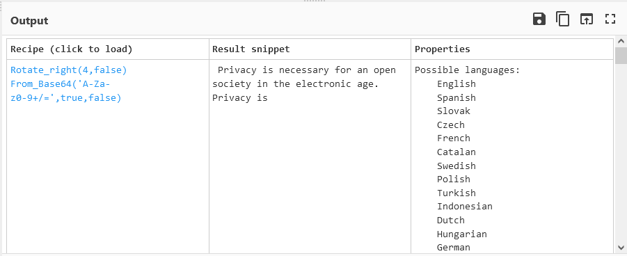
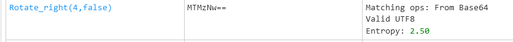
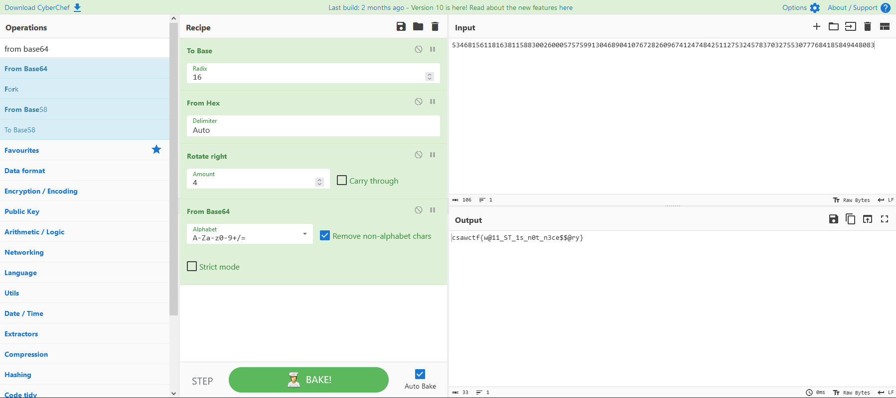

# Br3akTh3V@ult 
**Points: 499** 

**Category: forensics**

> 'Greed is good.'
> * Gordon Gekko
> Come and Break My Vault

In this challenge, we're given 3 files: `ansible.cfg`, `main.yml`, and `runme.yml`.
Upon inspection, most lines in `ansible.cfg` seem to be commented out, and if we remove all such lines we can see that there's basically nothing that's not commented out in `ansible.cfg`, so it proves to be pretty useless.

Next we take a look at `runme.yml`. It seems to encrypt a secret and put it into a file. However, none of these files are encrypted, and nothing seems to be appended to `ansible.cfg`. So I concluded that it simply wasn't worth pursuing further.

So we're only left with `main.yml`. If we open the file, we see some config variables for `runme.yml`, and some suspicious looking numbers. I started with the giant hex number and threw it into CyberChef and decoded it as hex.

Since I didn't know what to do, I just threw it into the Magic operation. Running it regularly didn't do anything, so I turned on intensive mode and it indeed found something interesting:

Unfortunately, this is just an excerpt from the Cypherpunk manifesto and there isn't a flag here.

So I moved on to the next number, `sus1337`. Since this seemed to be a regular decimal number and not hex, I ran the `To Base` operation on it with `16` first before converting it `From Hex`. Then, I ran `Magic` again, and found this in the results list:

Notice that this is the EXACT same encoding as before. Decoding this with Base64, we get the string `1337`. So maybe we can try this on the last number too? It also seems to be decimal so we can probably use the same sequence of operations.

And indeed, it works:

GG! Flag: `csawctf{w@11_ST_1s_n0t_n3ce$$@ry}`.

