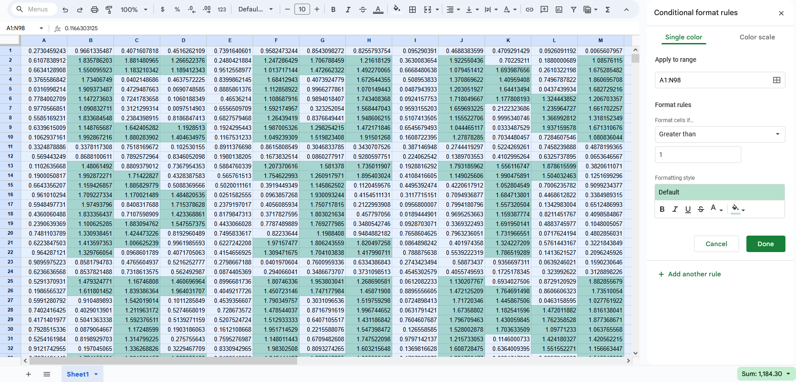

# misc/incredible
To be honest, this challenge was like one of those math problems where it was easy if you knew the one trick to solve, but where it would be insanely hard to solve if you didn't figure it out. It was "cute" (at least if your name was cat) but kind of annoying at the same time.

The first thing I tried was trying to look at the decimal digits as ASCII. However, I tried almost everything and I couldn't get legible text.

I also tried doing stuff like SUM-ing and AVERAGE-ing the columns, but that led to even more gibberish.

The key to this is realizing that for some strange reason about half or so of the numbers are less than one and the other half is greater. So I tried filtering out the ones greater by coloring them, and I got something that looked like text!

After that, it was just a matter of reading out the text and putting it into the flag format: `LITCTF{CONDITIONAL_FORMATTING11!}`.
