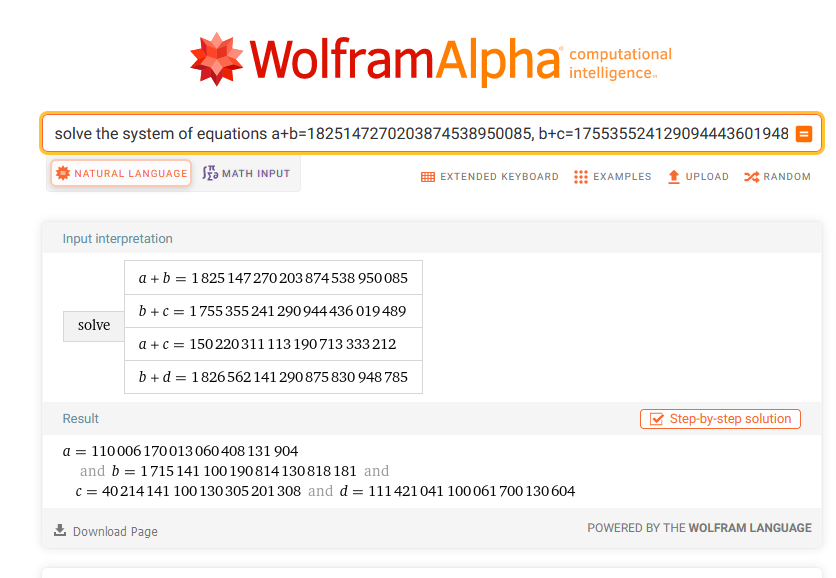
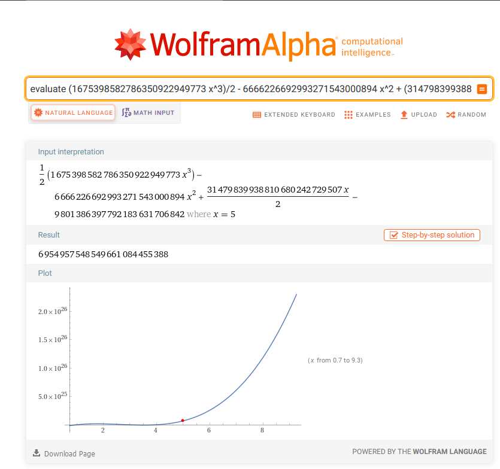

# crypto/are YOU smarter than Joseph-Louis Lagrange????

This was a really nice and high quality problem by @cat in LITCTF 2023. It was kind of guessy at times but IMO it was pretty satisfying at the end when you solved it.

The challenge gives us a PDF that has a text message conversation with one of those clickbait Facebook math problems. There's a system of equation with fruits, and the fruits appear to be the outputs of some function $f(x)$.

Going step by step, I solved the system first, since it was the first thing that was easily solvable. The numbers were small enough, so I just plugged it into Wolfram Alpha (where $a, b, c, d$ are the apple, banana, pear, and pineapple respectively) and it gave me the solutions:
[](https://www.wolframalpha.com/input?i=solve+the+system+of+equations+a%2Bb%3D1825147270203874538950085%2C+b%2Bc%3D1755355241290944436019489%2C+a%2Bc%3D150220311113190713333212%2C+b%2Bd%3D1826562141290875830948785https://www.wolframalpha.com/input?i=solve+the+system+of+equations+a%2Bb%3D1825147270203874538950085%2C+b%2Bc%3D1755355241290944436019489%2C+a%2Bc%3D150220311113190713333212%2C+b%2Bd%3D1826562141290875830948785)

Next, we need to figure out how we're going to find out the value of ?. It's not part of the system of equations, but the question mark is referenced as the output of $f(5)$. So we need a function that fits the first 4 outputs, and we could use that to figure out the 5th one (i.e. interpolate it).

There's a method of interpolation called Lagrange Interpolation which gives a polynomial that fits an arbitrary amount of points which I found out about. It's probably what's hinted at by the title ("are you smarter than joseph-louis lagrange????"), so I used Wolfram Alpha to apply it and find $f$:
[![Wolfram Alpha doing the Lagrange interpolation]](https://www.wolframalpha.com/input?i=lagrange+interpolation+with+points+%281%2C+110006170013060408131904%29%2C+%282%2C+1715141100190814130818181%29%2C+%283%2C+40214141100130305201308%29%2C+%284%2C+111421041100061700130604%29)
Then it was just a matter of plugging in $x=5$, and I had the value of the question mark!
[](https://www.wolframalpha.com/input?i=evaluate+%281675398582786350922949773+x%5E3%29%2F2+-+6666226692993271543000894+x%5E2+%2B+%2831479839938810680242729507+x%29%2F2+-+9801386397792183631706842+at+x%3D5)
So to briefly summarize, we have that:
$$\begin{cases}
a = 110006170013060408131904 \\
b = 1715141100190814130818181 \\ 
c = 40214141100130305201308 \\
d = 111421041100061700130604 \\
e = 6954957548549661084455388
\end{cases}$$
(I'm writing $e$ for the question mark and using the same letters for the fruits as I did before.)

Now our final task is figuring out how to convert this to letters. Thankfully, the messages give us a small hint:
> **A**: hint: you need to cut the fruits into pairs to get letters 😱

> **B**: but that doesn’t work for the question mark 😭

> **A**: that’s because you need to cut those into singles

I inferred that "pairs" probably meant groups of 2 letters. Indeed, if you do this and split everything into pairs of 2, all of the pairs will form a number between 0 and 25, which is very likely referring to different letters of the alphabet. (Some numbers have an odd number of digits, but adding zeroes to either the front or back seems to fix it).

This clearly doesn't work for $e$, but the messages also tells us that they need to be in "singles". Given that the fruits decoded to indices of the alphabet, I assumed that it was true for the question mark too.

I then wrote a quick decryption script that just looped through and decoded the flag:
```python3
fruits = [
    '110006170013060408131904',
    '1715141100190814130818181',
    '40214141100130305201308',
    '111421041100061700130604'
]
flag = 'LITCTF{'

for fruit in fruits:
    n = fruit 
    if len(n) % 2 != 0:
        # check which side needs padding with zeroes, and add if needed
        v = int(n[0] + n[1])
        if v <= 25:
            n += '0'
        else:
            n = '0' + n
    for i in range(0, len(n), 2):
        flag += chr(ord('a') + int(n[i] + n[i+1]))

question = '6954957548549661084455388'
for d in question:
    flag += chr(ord('a') + int(d))

flag += '}'
print(flag)
```

Finally, we get the flag after all this work: `LITCTF{lagrangeinterpolationisskecoolandfunilovelagrangegjfejfhfeifejggbaieeffdii}`.

